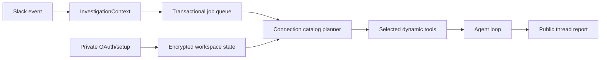

# Architecture

Every Slack request has a workspace, channel, thread, actor, request ID, and job. Jobs serialize within one thread and run concurrently across threads. Duplicate Slack deliveries and replayed actions are rejected.

Service definitions are validated runtime specifications. Shared OAuth client credentials are scoped per workspace unless environment-provisioned. User grants are scoped by workspace, user, and service. The agent receives connection capabilities and owner metadata, then invokes namespaced tools so results cannot cross accounts.

SQLite runs in WAL mode with foreign keys and transactional updates. OAuth client secrets, user tokens, remote credentials, and Slack installation tokens are encrypted before storage.

One shared LLM gateway manages all configured keys, cooldowns, and concurrency. When every key is rate-limited, the job is persisted, the thread is warned once, and work resumes after the earliest retry time.
