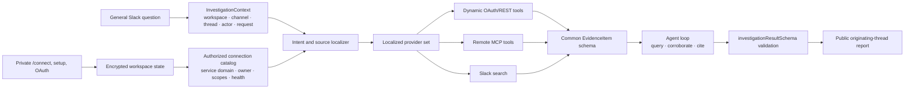

# Architecture

## Source localization and synthesis

Before an investigation starts, the intent classifier receives only the connected source IDs and each service’s declared data domain. It returns the subset plausibly relevant to the question even when the user never names a provider. Dynamic OAuth/REST providers and Slack search are then hard-limited to that subset. If classification has no source signal, providers remain available and the investigation agent performs tool-level selection from their descriptions. Remote MCP tools are selected at the agent stage because their capabilities come from live tool discovery rather than a service-domain specification.

The agent may call several namespaced tools in one run. Dynamic REST and remote MCP responses are converted to `EvidenceItem` records, so data from different providers shares IDs, timestamps, URLs, source labels, and confidence metadata. The final answer may cite only evidence actually returned by those calls and must pass `investigationResultSchema`.

## Isolation and resilience

Every Slack request has a workspace, channel, thread, actor, request ID, and job. Jobs serialize within one thread and run concurrently across threads. Duplicate Slack deliveries and replayed actions are rejected.

Service definitions are validated runtime specifications. Shared OAuth client credentials are scoped per workspace unless environment-provisioned. User grants are scoped by workspace, user, and service. Tools are namespaced by connection so two services—or two owners of the same service—cannot collide.

SQLite runs in WAL mode with foreign keys and transactional updates. OAuth client secrets, user tokens, remote credentials, and Slack installation tokens are encrypted before storage.

One shared LLM gateway manages all configured keys, cooldowns, and concurrency. When every key is rate-limited, the job is persisted, the thread is warned once, and work resumes after the earliest retry time.
