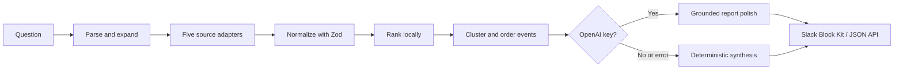

# Architecture

Slack Detective is a modular retrieval-and-synthesis pipeline. Slack and HTTP are thin delivery layers over the same `InvestigationPipeline`.



## Pipeline stages

1. **Parse:** tokenizes the question and adds a small, explicit synonym expansion.
2. **Search:** calls all adapters concurrently. The demo adapters search local records; real adapters can call vendor APIs.
3. **Normalize:** every clue is validated as an `EvidenceItem` with Zod.
4. **Rank:** combines keyword overlap, entity matches, tags, recency, source authority, and record confidence.
5. **Cluster:** groups related same-day evidence into events and sorts it chronologically.
6. **Synthesize:** produces a short answer, likely root cause, confidence, open questions, and actions. OpenAI is optional and cannot alter the selected evidence or timeline.
7. **Present:** renders a compact detective board in Slack or returns typed JSON over HTTP.

## Adapter contract

```ts
interface EvidenceConnector {
  name: string;
  search(query: InvestigationQuery): Promise<EvidenceItem[]>;
  getById(id: string): Promise<EvidenceItem | null>;
}
```

Adding a real connector does not change ranking, synthesis, Slack, or API code. Authentication, pagination, and source-specific mapping stay inside the adapter.

## Grounding and graceful degradation

- Search is never delegated to the language model.
- The ranked evidence list and generated timeline are treated as immutable inputs to OpenAI.
- OpenAI output is validated; malformed output or network failure uses the local fallback.
- Important Slack claims sit next to source links, and expanded views expose evidence IDs.

## MVP tradeoffs

Local JSON keeps setup instant and demos deterministic. Production work would add OAuth-backed connectors, persistent report/follow-up storage, access-control filtering, audit logs, pagination, and evaluation telemetry.
