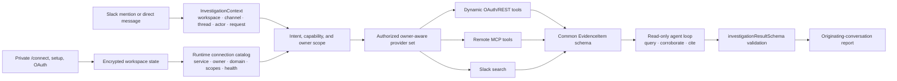

# Architecture

## Identity and source selection

Every Slack delivery is normalized into an `InvestigationContext` containing the workspace, channel, thread, actor, and request id. Thread transcripts retain each Slack author id, and only the agent’s own mention is removed from an incoming prompt, so references to another member remain resolvable.

The router receives the requesting user id and an owner-labelled runtime connection catalog. Personal pronouns deterministically restrict eligible connection owners to the requester. Explicit member mentions select those owners, while team- or workspace-wide questions leave the authorized catalog broad. Both dynamic service tools and remote MCP tools apply the resulting owner scope before the model sees them.

The router also localizes service ids by their declared data domains. If it has no reliable source signal, it leaves the eligible provider set ungated and the agent selects tools from their live descriptions. Tool names remain namespaced by connection, preventing service or owner collisions.

## Read-only truthfulness

Connection tools can only retrieve records. Mutation requests are rejected before an investigation job is created, and the agent prompt independently forbids claims that it edited, sent, stopped, scheduled, committed, merged, or deployed anything. Reports do not contain action controls that imply write access.

Every factual conclusion must cite an `EvidenceItem` returned by a tool. Thread history is context, never evidence. The final object must satisfy `investigationResultSchema` before it is rendered in Slack.

## Isolation and resilience

Jobs serialize within one thread and run concurrently across threads. Duplicate Slack deliveries are rejected. User grants are keyed by workspace, user, and service; shared OAuth client configuration remains workspace-scoped.

SQLite runs in WAL mode with foreign keys and transactional updates. OAuth client secrets, user tokens, remote credentials, and Slack installation tokens are encrypted before storage. Language-model capacity waits are persisted and resumed only for the original `InvestigationContext`.
