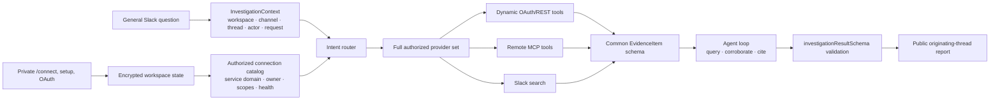

# Architecture

## Full-sweep investigation and synthesis

The intent router only classifies what an incoming message wants — investigate, connect, list, or help — and never pre-filters sources. Every investigation exposes all of the user's authorized connections (dynamic OAuth/REST tools, remote MCP tools, and Slack search) to the agent, which sweeps them and reports what each source did and did not contribute. Batching tool calls for different sources lets the sweep run in parallel within one agent turn.

The agent may call several namespaced tools in one run. Dynamic REST and remote MCP responses are converted to `EvidenceItem` records, so data from different providers shares IDs, timestamps, URLs, source labels, and confidence metadata. The agent never treats its own prior Slack replies as evidence. The final answer may cite only evidence actually returned by those calls and must pass `investigationResultSchema`.

## Isolation and resilience

Every Slack request has a workspace, channel, thread, actor, request ID, and job. Jobs serialize within one thread and run concurrently across threads. Duplicate Slack deliveries and replayed actions are rejected.

Service definitions are validated runtime specifications. Shared OAuth client credentials are scoped per workspace unless environment-provisioned. User grants are scoped by workspace, user, and service. Tools are namespaced by connection so two services—or two owners of the same service—cannot collide.

SQLite runs in WAL mode with foreign keys and transactional updates. OAuth client secrets, user tokens, remote credentials, and Slack installation tokens are encrypted before storage.

One shared LLM gateway manages all configured keys, cooldowns, and concurrency. When every key is rate-limited, the job is persisted, the thread is warned once, and work resumes after the earliest retry time.
